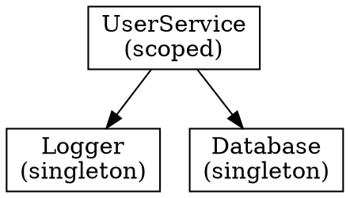
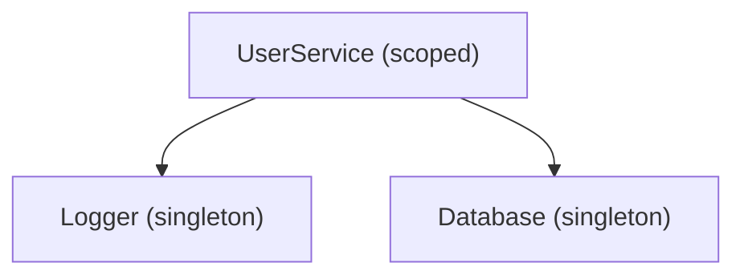

# Spec Requirements: @hex-di/devtools Package

## Initial Description
Implement graph export to JSON, DOT (Graphviz), and Mermaid formats for documentation and tooling integration. Based on deep research of TanStack DevTools, Redux DevTools, Angular DevTools, and React DevTools, the scope has been expanded to a full DevTools package following TanStack-style architecture.

## Requirements Discussion

### First Round Questions

**Q1:** I assume this feature should live in `@hex-di/devtools` package based on the tech stack architecture (devtools depends on all packages). Is that correct, or should it be a standalone export utility in `@hex-di/graph` to minimize dependencies?
**Answer:** Package Location: `@hex-di/devtools` (new package). This follows the TanStack pattern of a dedicated devtools package.

**Q2:** For the JSON format, I'm thinking we could extend the existing `serializeGraph()` pattern from `@hex-di/testing` but with additional metadata (like edge relationships explicitly modeled). Should the JSON format be compatible with GraphSnapshot, a richer format, or multiple variants?
**Answer:** New nodes/edges structure optimized for visualization tools. This is different from the testing `GraphSnapshot` format - it should be designed for visualization consumption with explicit node and edge modeling.

**Q3:** For DOT (Graphviz) output, I assume we want to show nodes as adapters, edges as dependencies, and node styling based on lifetime. Should we include additional visual cues like clustering by lifetime scope?
**Answer:** Simple default output with optional presets for styling. Keep the base output clean for documentation, with options for advanced styling.

**Q4:** For Mermaid output, should we support only flowchart syntax, both flowchart and class diagram, or flowchart with subgraphs?
**Answer:** Composable transform -> export pattern. Provide base Mermaid flowchart output with transform utilities that can modify the graph before export (filtering, relabeling, etc.).

**Q5:** I assume all export functions should be pure (no side effects) and return strings. Should we also provide file-writing convenience functions?
**Answer:** Pure functions only (return strings). File I/O is left to consumers.

**Q6:** Should the export functions support options for custom node labels, filtering, and direction?
**Answer:** Yes, through composable transform utilities like `filterGraph()` and `relabelPorts()` that can be applied before export.

**Q7:** Is there anything specific you want to EXCLUDE from this feature?
**Answer:**
- Browser extension (out of scope for Phase 1)
- Import functionality (parsing DOT/Mermaid back to Graph)
- Real-time graph watching during development
- Resolution tracing / profiling
- Instance inspection (resolved values)
- Time-travel debugging

### Existing Code to Reference

**Similar Features Identified:**
- Feature: `serializeGraph` - Path: `/Users/mohammadalmechkor/Projects/hex-di/packages/testing/src/graph-snapshot.ts`
  - Provides reference implementation for extracting graph metadata
  - Shows pattern for accessing `adapter.provides.__portName` and `adapter.requires`
  - Demonstrates deterministic output (sorting for stability)

No other similar features identified for reference.

### Follow-up Questions
None required - comprehensive requirements gathered from architecture analysis.

## Visual Assets

### Files Provided:
No visual assets provided.

### Visual Insights:
N/A

## Requirements Summary

### Functional Requirements

#### 1. Export Functions (Framework-Agnostic Core)
- `toJSON(graph)` - Returns `ExportedGraph` with nodes/edges structure optimized for visualization
- `toDOT(graph, options?)` - Returns Graphviz DOT format string
- `toMermaid(graph, options?)` - Returns Mermaid diagram format string
- Transform utilities:
  - `filterGraph()` - Filter adapters by criteria (lifetime, port name patterns, etc.)
  - `relabelPorts()` - Custom labeling for nodes

#### 2. React DevTools Panel
- `<DevToolsPanel>` - Embeddable panel component for integration into app UI
- `<DevToolsFloating>` - Toggle-able floating overlay (TanStack-style pattern)
- Features:
  - Interactive graph visualization (nodes = adapters, edges = dependencies)
  - Container inspection (list of ports, adapters, lifetimes)
  - Visual differentiation by lifetime scope

#### 3. Core Inspection (Framework-Agnostic)
- Graph analyzer - Extract structure from Graph object
- Container inspector - Browse registered adapters
- Basic scope tree view

### Reusability Opportunities
- Extend patterns from `serializeGraph` in @hex-di/testing for metadata extraction
- Follow existing package conventions (barrel exports, co-located tests, kebab-case files)
- Use same Port/Adapter type inference utilities from @hex-di/graph

### Scope Boundaries

**In Scope (Phase 1 MVP):**
- Export functions: `toJSON`, `toDOT`, `toMermaid`
- Transform utilities: `filterGraph`, `relabelPorts`
- React components: `<DevToolsPanel>`, `<DevToolsFloating>`
- Graph structure analysis
- Container inspection UI
- Basic scope tree visualization
- Auto-exclusion from production builds
- Tree-shakeable architecture

**Out of Scope (Phase 1):**
- Browser extension (Chrome DevTools panel)
- Resolution tracing / profiling
- Instance inspection (viewing resolved service values)
- Time-travel debugging
- Real-time watching / hot reload integration
- Import functionality (parsing DOT/Mermaid back to Graph)

### Technical Considerations

#### Package Architecture
- New package: `@hex-di/devtools`
- Dependencies: @hex-di/graph, @hex-di/runtime, @hex-di/ports
- Peer dependency: React 18+ (for React components)
- Framework-agnostic core with React adapter (TanStack pattern)

#### Build Considerations
- Must be tree-shakeable
- Should be auto-excludable from production builds (e.g., via dead code elimination when not imported)
- Pure functions for all export utilities

#### API Design Pattern
- Composable: transform graph -> then export
- Example flow: `toMermaid(filterGraph(graph, { lifetime: 'singleton' }))`
- Options objects for customization (direction, styling presets)

#### Data Structures

**ExportedGraph (JSON format):**
```typescript
interface ExportedGraph {
  nodes: ExportedNode[];
  edges: ExportedEdge[];
}

interface ExportedNode {
  id: string;        // Port name
  label: string;     // Display label
  lifetime: Lifetime;
  // Additional metadata as needed
}

interface ExportedEdge {
  from: string;      // Dependent adapter's port name
  to: string;        // Required port name
}
```

#### DOT Output Example


#### Mermaid Output Example

