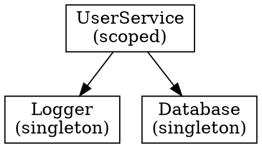
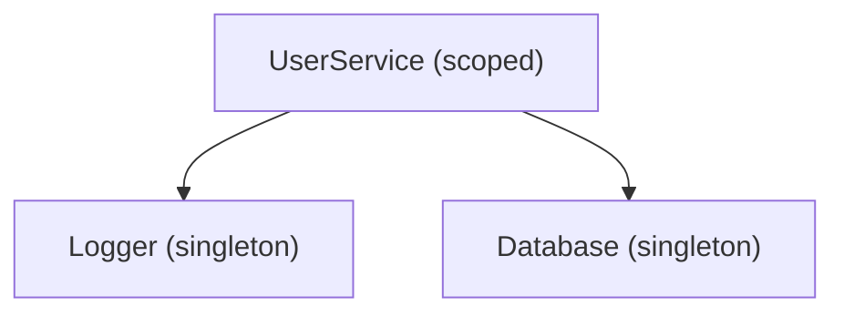

# Task Breakdown: @hex-di/devtools Package

## Overview
Total Tasks: 10 Task Groups

This package provides graph visualization export utilities and React DevTools components for HexDI dependency injection library. It enables developers to export dependency graphs to JSON, DOT (Graphviz), and Mermaid formats for documentation, and provides React-based DevTools UI components for runtime graph visualization and container inspection.

## Dependencies
- `@hex-di/ports` - Port type definitions and utilities
- `@hex-di/graph` - Graph, Adapter types
- `@hex-di/runtime` - Container, Scope types
- `react` (peer) - For React DevTools components

## Task List

### Task Group 1: Package Infrastructure
**Dependencies:** None

- [x] 1.0 Complete package infrastructure setup
  - [x] 1.1 Create package directory structure
    - Create `/packages/devtools/` directory
    - Create `/packages/devtools/src/` for source files
    - Create `/packages/devtools/tests/` for test files
    - Create `/packages/devtools/src/react/` for React-specific exports
  - [x] 1.2 Create package.json with proper configuration
    - Name: `@hex-di/devtools`
    - Version: `0.1.0`
    - Type: `module`
    - Dependencies: `@hex-di/ports`, `@hex-di/graph`, `@hex-di/runtime`
    - Peer dependencies: `react` (optional, for React components)
    - Configure subpath exports:
      - `.` - Main entry (framework-agnostic export utilities)
      - `./react` - React-specific DevTools components
    - Scripts: build, clean, test, test:watch, test:types, typecheck
    - Set `"sideEffects": false` for tree-shaking
    - Follow pattern from `@hex-di/testing` package.json
  - [x] 1.3 Create tsconfig.json
    - Extend root tsconfig.json
    - Configure rootDir, outDir, composite
    - Include src and tests directories
    - Follow pattern from `@hex-di/testing` tsconfig.json
  - [x] 1.4 Create tsconfig.build.json for production builds
    - Exclude tests from build output
    - Configure declaration file generation
  - [x] 1.5 Create main entry point src/index.ts
    - Export placeholder types/functions (to be implemented)
    - Add package documentation JSDoc header
    - Re-export common types from @hex-di/graph for convenience
  - [x] 1.6 Create React subpath entry point src/react/index.ts
    - Export placeholder for React DevTools components
    - Add JSDoc documentation for subpath purpose
  - [x] 1.7 Verify package builds successfully
    - Run `pnpm build` in devtools package
    - Verify dist/ output contains expected files
    - Verify subpath exports resolve correctly

**Acceptance Criteria:**
- Package directory structure matches other packages
- package.json has correct dependencies and exports configuration
- tsconfig.json properly configured with composite mode
- Package builds without errors
- Subpath exports resolve correctly (./react)

---

### Task Group 2: Core Types and ExportedGraph Structure
**Dependencies:** Task Group 1

- [x] 2.0 Complete core types implementation
  - [x] 2.1 Write 4-6 focused tests for ExportedGraph types
    - Test ExportedNode has correct shape (id, label, lifetime)
    - Test ExportedEdge has correct shape (from, to)
    - Test ExportedGraph has nodes and edges arrays
    - Test type inference with Graph input
    - Test immutability of exported structures
  - [x] 2.2 Create src/types.ts
    - Define `ExportedNode` interface: `{ id: string, label: string, lifetime: Lifetime }`
    - Define `ExportedEdge` interface: `{ from: string, to: string }`
    - Define `ExportedGraph` interface: `{ nodes: ExportedNode[], edges: ExportedEdge[] }`
    - Use `readonly` for all properties to enforce immutability
    - Export all types
  - [x] 2.3 Define export options types
    - Define `DOTOptions`: `{ direction?: 'TB' | 'LR', preset?: 'minimal' | 'styled' }`
    - Define `MermaidOptions`: `{ direction?: 'TD' | 'LR' }`
    - Export options types
  - [x] 2.4 Define filter predicate types
    - Define `NodePredicate`: `(node: ExportedNode) => boolean`
    - Define `LabelTransform`: `(node: ExportedNode) => string`
    - Export predicate types
  - [x] 2.5 Export types from src/index.ts
    - Add all types to main package exports
    - Add JSDoc documentation
  - [x] 2.6 Ensure type tests pass
    - Run type tests written in 2.1
    - Verify all type constraints work correctly

**Acceptance Criteria:**
- Tests from 2.1 pass
- All types are properly defined and exported
- Types are immutable (readonly properties)
- Type inference works correctly with Graph input

---

### Task Group 3: toJSON Export Function
**Dependencies:** Task Groups 1, 2

- [x] 3.0 Complete toJSON implementation
  - [x] 3.1 Write 4-6 focused tests for toJSON
    - Test returns ExportedGraph with nodes and edges arrays
    - Test nodes have correct id, label, and lifetime from adapters
    - Test edges represent dependency relationships (from dependent to required)
    - Test output is deterministic (sorted by port name)
    - Test empty graph returns empty arrays
    - Test graph with no dependencies has empty edges array
  - [x] 3.2 Create src/to-json.ts
    - Implement `toJSON(graph: Graph<Port>)` function
    - Return type: `ExportedGraph`
    - Follow pattern from `serializeGraph` in @hex-di/testing
  - [x] 3.3 Implement node extraction
    - Extract port name from `adapter.provides.__portName`
    - Use port name as both `id` and default `label`
    - Extract lifetime from `adapter.lifetime`
    - Create `ExportedNode` for each adapter
  - [x] 3.4 Implement edge extraction
    - For each adapter, iterate `adapter.requires`
    - Create edge `{ from: providerPortName, to: requiredPortName }`
    - Edge direction: from dependent to dependency
  - [x] 3.5 Implement deterministic sorting
    - Sort nodes alphabetically by id (port name)
    - Sort edges by `from` then by `to` for stability
    - Ensures consistent output across runs
  - [x] 3.6 Export toJSON from src/index.ts
    - Add to main package exports
    - Add JSDoc documentation with examples
  - [x] 3.7 Ensure toJSON tests pass
    - Run tests written in 3.1
    - Verify all test cases pass

**Acceptance Criteria:**
- Tests from 3.1 pass
- toJSON accepts Graph and returns ExportedGraph
- Nodes contain id, label, and lifetime
- Edges represent dependency relationships
- Output is deterministic (sorted)

---

### Task Group 4: toDOT Export Function
**Dependencies:** Task Groups 1, 2, 3

- [x] 4.0 Complete toDOT implementation
  - [x] 4.1 Write 4-6 focused tests for toDOT
    - Test returns valid DOT format string with digraph wrapper
    - Test default direction is TB (top-bottom)
    - Test node labels include port name and lifetime
    - Test edges use arrow syntax (->)
    - Test LR direction option works
    - Test styled preset adds visual differentiation
  - [x] 4.2 Create src/to-dot.ts
    - Implement `toDOT(graph: Graph<Port>, options?: DOTOptions)` function
    - Return type: `string` (valid Graphviz DOT syntax)
    - Accept options for direction and preset
  - [x] 4.3 Implement DOT structure generation
    - Start with `digraph DependencyGraph {`
    - Add `rankdir=TB;` or `rankdir=LR;` based on options.direction
    - Add default node styling: `node [shape=box];`
    - Close with `}`
  - [x] 4.4 Implement node rendering
    - Format: `"PortName" [label="PortName\n(lifetime)"];`
    - Escape special characters in port names for DOT safety
    - Include all nodes from ExportedGraph
  - [x] 4.5 Implement edge rendering
    - Format: `"FromPort" -> "ToPort";`
    - Include all edges from ExportedGraph
  - [x] 4.6 Implement styled preset
    - Add color differentiation by lifetime:
      - singleton: `fillcolor="#E8F5E9"` (green tint)
      - scoped: `fillcolor="#E3F2FD"` (blue tint)
      - request: `fillcolor="#FFF3E0"` (orange tint)
    - Add `style=filled` for styled nodes
  - [x] 4.7 Export toDOT from src/index.ts
    - Add to main package exports
    - Add JSDoc documentation with examples
  - [x] 4.8 Ensure toDOT tests pass
    - Run tests written in 4.1
    - Verify all test cases pass

**Acceptance Criteria:**
- Tests from 4.1 pass
- toDOT returns valid Graphviz DOT format
- Direction option (TB/LR) works
- Node labels show port name and lifetime
- Styled preset adds color differentiation

**Expected DOT Output Example:**


---

### Task Group 5: toMermaid Export Function
**Dependencies:** Task Groups 1, 2, 3

- [x] 5.0 Complete toMermaid implementation
  - [x] 5.1 Write 4-6 focused tests for toMermaid
    - Test returns valid Mermaid flowchart syntax
    - Test default direction is TD (top-down)
    - Test node labels formatted as `PortName["PortName (lifetime)"]`
    - Test edges use `-->` arrow syntax
    - Test LR direction option works
    - Test special characters in port names are escaped
  - [x] 5.2 Create src/to-mermaid.ts
    - Implement `toMermaid(graph: Graph<Port>, options?: MermaidOptions)` function
    - Return type: `string` (valid Mermaid syntax)
    - Accept options for direction
  - [x] 5.3 Implement Mermaid structure generation
    - Start with `graph TD` or `graph LR` based on options.direction
    - Add node definitions
    - Add edge definitions
  - [x] 5.4 Implement node rendering
    - Format: `PortName["PortName (lifetime)"]`
    - Escape special characters for Mermaid safety (quotes, brackets)
    - Include all nodes from ExportedGraph
  - [x] 5.5 Implement edge rendering
    - Format: `FromPort --> ToPort`
    - Include all edges from ExportedGraph
  - [x] 5.6 Handle special characters
    - Escape double quotes in labels
    - Handle port names with special characters
    - Ensure output is valid Mermaid syntax
  - [x] 5.7 Export toMermaid from src/index.ts
    - Add to main package exports
    - Add JSDoc documentation with examples
  - [x] 5.8 Ensure toMermaid tests pass
    - Run tests written in 5.1
    - Verify all test cases pass

**Acceptance Criteria:**
- Tests from 5.1 pass
- toMermaid returns valid Mermaid flowchart syntax
- Direction option (TD/LR) works
- Node labels show port name and lifetime
- Special characters are properly escaped

**Expected Mermaid Output Example:**


---

### Task Group 6: Transform Utilities (filterGraph, relabelPorts)
**Dependencies:** Task Groups 1, 2, 3

- [x] 6.0 Complete transform utilities implementation
  - [x] 6.1 Write 4-6 focused tests for transform utilities
    - Test filterGraph returns new ExportedGraph with filtered nodes
    - Test filterGraph removes edges connected to filtered nodes
    - Test byLifetime helper filters by lifetime
    - Test byPortName helper filters by regex pattern
    - Test relabelPorts transforms node labels
    - Test relabelPorts preserves node IDs
  - [x] 6.2 Create src/filter-graph.ts
    - Implement `filterGraph(exportedGraph: ExportedGraph, predicate: NodePredicate)` function
    - Return type: `ExportedGraph` (new instance)
    - Filter nodes by predicate
    - Remove edges that reference filtered nodes
  - [x] 6.3 Implement built-in filter helpers
    - `byLifetime(lifetime: Lifetime)` - Returns predicate for lifetime matching
    - `byPortName(pattern: RegExp)` - Returns predicate for port name regex matching
    - Both return `NodePredicate` functions
  - [x] 6.4 Create src/relabel-ports.ts
    - Implement `relabelPorts(exportedGraph: ExportedGraph, labelFn: LabelTransform)` function
    - Return type: `ExportedGraph` (new instance)
    - Transform node labels using labelFn
    - Preserve node IDs (used for edge references)
  - [x] 6.5 Ensure immutability
    - All transform functions return new objects
    - Original ExportedGraph is not modified
    - Use spread operators or Object.freeze
  - [x] 6.6 Export transforms from src/index.ts
    - Export filterGraph, byLifetime, byPortName, relabelPorts
    - Add JSDoc documentation with composable examples
  - [x] 6.7 Ensure transform utility tests pass
    - Run tests written in 6.1
    - Verify all test cases pass

**Acceptance Criteria:**
- Tests from 6.1 pass
- filterGraph returns filtered ExportedGraph
- Edge cleanup removes edges to/from filtered nodes
- byLifetime and byPortName helpers work correctly
- relabelPorts transforms labels but preserves IDs
- All transforms are immutable (return new instances)

**Composable Usage Example:**
```typescript
// Filter to singletons only, then export to Mermaid
const singletons = filterGraph(toJSON(graph), byLifetime('singleton'));
const mermaid = toMermaid(singletons);

// Custom label transformation
const relabeled = relabelPorts(toJSON(graph), (node) =>
  `${node.label} [${node.lifetime}]`
);
```

---

### Task Group 7: React DevToolsPanel Component
**Dependencies:** Task Groups 1, 2, 3

- [x] 7.0 Complete DevToolsPanel implementation
  - [x] 7.1 Write 4-6 focused tests for DevToolsPanel
    - Test renders without crashing with graph prop
    - Test displays nodes from graph
    - Test displays edges/dependencies
    - Test visual differentiation by lifetime
    - Test collapsible sections work
    - Test container inspection shows ports and lifetimes
  - [x] 7.2 Create src/react/devtools-panel.tsx
    - Implement `<DevToolsPanel graph={graph} container={container} />` component
    - Import React hooks and types
    - Accept Graph and optional Container props
    - Follow pattern from `createTypedHooks` in @hex-di/react
  - [x] 7.3 Implement graph visualization view
    - Display nodes as list items with port name and lifetime
    - Show edges as dependency arrows or indented list
    - Use ExportedGraph from toJSON internally
    - Minimal styling focused on developer readability
  - [x] 7.4 Implement container inspection view
    - List all registered ports with their adapters
    - Show lifetime for each port
    - Show dependency count
    - Collapsible detail view for each adapter
  - [x] 7.5 Implement visual differentiation
    - Color-code or badge nodes by lifetime
    - Singleton: green indicator
    - Scoped: blue indicator
    - Request: orange indicator
    - Use CSS classes for styling
  - [x] 7.6 Implement collapsible sections
    - Graph View section (collapsible)
    - Container Browser section (collapsible)
    - Use useState for collapse state
  - [x] 7.7 Add minimal CSS styles
    - Create src/react/styles.ts with CSS-in-JS styles
    - Developer-focused aesthetic (similar to TanStack DevTools)
    - Monospace font for code-like appearance
    - Dark/light theme support via CSS variables
  - [x] 7.8 Export DevToolsPanel from src/react/index.ts
    - Add to React subpath exports
    - Add JSDoc documentation with examples
  - [x] 7.9 Ensure DevToolsPanel tests pass
    - Run tests written in 7.1
    - Verify all test cases pass

**Acceptance Criteria:**
- Tests from 7.1 pass
- DevToolsPanel renders graph visualization
- Container inspection shows ports and lifetimes
- Visual differentiation by lifetime works
- Collapsible sections function correctly
- Exported from @hex-di/devtools/react subpath

---

### Task Group 8: React DevToolsFloating Component
**Dependencies:** Task Groups 1, 7

- [x] 8.0 Complete DevToolsFloating implementation
  - [x] 8.1 Write 4-6 focused tests for DevToolsFloating
    - Test renders toggle button by default
    - Test clicking toggle expands to full panel
    - Test position prop affects placement
    - Test localStorage state persistence
    - Test production mode renders null
    - Test DevToolsPanel is rendered when expanded
  - [x] 8.2 Create src/react/devtools-floating.tsx
    - Implement `<DevToolsFloating graph={graph} container={container} />` component
    - Accept position prop: `'bottom-right' | 'bottom-left' | 'top-right' | 'top-left'`
    - Default position: `'bottom-right'`
    - Follow TanStack DevTools toggle pattern
  - [x] 8.3 Implement toggle button
    - Small fixed-position button (e.g., 40x40px)
    - Icon or text indicator for DevTools
    - Positioned based on position prop
    - Click handler toggles panel visibility
  - [x] 8.4 Implement panel expansion
    - Expanded state shows DevToolsPanel
    - Overlay or slide-out panel behavior
    - Close button to collapse back to toggle
    - Configurable panel dimensions
  - [x] 8.5 Implement localStorage persistence
    - Store open/closed state in localStorage
    - Key: `hex-di-devtools-open`
    - Restore state on mount
    - Update on toggle
  - [x] 8.6 Implement production mode detection
    - Check `process.env.NODE_ENV`
    - Return `null` if `NODE_ENV === 'production'`
    - Ensure tree-shaking removes component in production
  - [x] 8.7 Add floating-specific styles
    - Fixed positioning based on position prop
    - Z-index management for overlay
    - Transition animations for open/close
    - Add to src/react/styles.ts
  - [x] 8.8 Export DevToolsFloating from src/react/index.ts
    - Add to React subpath exports
    - Add JSDoc documentation with examples
  - [x] 8.9 Ensure DevToolsFloating tests pass
    - Run tests written in 8.1
    - Verify all test cases pass

**Acceptance Criteria:**
- Tests from 8.1 pass
- DevToolsFloating shows toggle button
- Toggle expands/collapses full DevTools panel
- Position prop works (all 4 corners)
- localStorage persistence works
- Returns null in production mode
- Exported from @hex-di/devtools/react subpath

---

### Task Group 9: Integration and Composability
**Dependencies:** Task Groups 3, 4, 5, 6

- [x] 9.0 Complete integration patterns
  - [x] 9.1 Write 4-6 focused integration tests
    - Test full pipeline: graph -> toJSON -> filterGraph -> toDOT
    - Test full pipeline: graph -> toJSON -> relabelPorts -> toMermaid
    - Test toDOT accepts ExportedGraph directly
    - Test toMermaid accepts ExportedGraph directly
    - Test chained transforms work correctly
    - Test all exports are pure functions
  - [x] 9.2 Implement overloaded export functions
    - `toDOT(graph: Graph)` - Converts graph to ExportedGraph internally
    - `toDOT(exportedGraph: ExportedGraph)` - Uses ExportedGraph directly
    - Same pattern for `toMermaid`
    - Type guards to detect input type
  - [x] 9.3 Add convenience re-exports
    - Re-export `Lifetime` from @hex-di/graph
    - Re-export common types consumers need
    - Follow pattern from @hex-di/testing index.ts
  - [x] 9.4 Verify tree-shaking works
    - Test importing only `toMermaid` doesn't pull React
    - Test importing only `filterGraph` doesn't pull toDOT
    - Ensure pure functions enable dead code elimination
  - [x] 9.5 Update barrel exports
    - Verify all public APIs are exported from appropriate entry points
    - Main entry: toJSON, toDOT, toMermaid, filterGraph, relabelPorts, byLifetime, byPortName
    - React entry: DevToolsPanel, DevToolsFloating
  - [x] 9.6 Ensure integration tests pass
    - Run tests written in 9.1
    - Verify all test cases pass

**Acceptance Criteria:**
- Tests from 9.1 pass
- Export functions accept both Graph and ExportedGraph
- Transforms compose correctly in pipelines
- Tree-shaking works (React not pulled for core exports)
- All public APIs properly exported

---

### Task Group 10: Type Tests and Quality Assurance
**Dependencies:** Task Groups 1-9

- [x] 10.0 Complete type tests and final verification
  - [x] 10.1 Create type-level tests (tests/*.test-d.ts)
    - Test toJSON return type is ExportedGraph
    - Test toDOT return type is string
    - Test toMermaid return type is string
    - Test filterGraph type inference
    - Test relabelPorts type inference
    - Test DevToolsPanel prop types
    - Test DevToolsFloating prop types
    - Follow pattern from `@hex-di/testing/tests/*.test-d.ts`
  - [x] 10.2 Review and fill test coverage gaps
    - Review tests from Task Groups 2-9
    - Identify critical gaps in integration scenarios
    - Add maximum 8 additional tests if needed
    - Focus on end-to-end workflows and edge cases
  - [x] 10.3 Create edge case tests
    - Test empty graph handling
    - Test graph with circular dependencies (if possible)
    - Test very large graphs (performance)
    - Test special characters in port names
  - [x] 10.4 Verify all exports are properly documented
    - Review JSDoc comments on all public exports
    - Ensure examples in documentation are accurate
    - Verify all types are exported that should be
  - [x] 10.5 Run full test suite for devtools package
    - Run `pnpm test` in devtools package
    - Run `pnpm test:types` for type tests
    - Verify all tests pass
  - [x] 10.6 Verify package integrates with monorepo
    - Run `pnpm build` from root
    - Verify devtools package builds as part of monorepo
    - Verify no circular dependency issues
    - Test import from other packages works

**Acceptance Criteria:**
- All type tests pass (test:types)
- All runtime tests pass (test)
- No more than 8 additional tests added for gaps
- Package builds successfully in monorepo
- All public APIs have JSDoc documentation
- Integration with other @hex-di packages works

---

## Execution Order

Recommended implementation sequence:

1. **Task Group 1: Package Infrastructure** - Foundation for all other work
2. **Task Group 2: Core Types and ExportedGraph** - Types needed by all export functions
3. **Task Group 3: toJSON Export Function** - Foundation for all other exports
4. **Task Group 4: toDOT Export Function** - Depends on toJSON
5. **Task Group 5: toMermaid Export Function** - Depends on toJSON (can parallelize with 4)
6. **Task Group 6: Transform Utilities** - Depends on types and toJSON (can parallelize with 4-5)
7. **Task Group 7: React DevToolsPanel** - Depends on toJSON for graph data
8. **Task Group 8: React DevToolsFloating** - Depends on DevToolsPanel
9. **Task Group 9: Integration and Composability** - Final integration of all components
10. **Task Group 10: Type Tests and Quality Assurance** - Final verification

### Parallelization Opportunities

- Task Groups 4, 5, 6 can be worked on in parallel after Task Group 3
- Task Group 7 can start as soon as Task Group 3 is complete
- Task Groups 8 depends only on Task Group 7

---

## File Structure Summary

```
packages/devtools/
  package.json
  tsconfig.json
  tsconfig.build.json
  src/
    index.ts                    # Main entry point
    types.ts                    # Task Group 2
    to-json.ts                  # Task Group 3
    to-dot.ts                   # Task Group 4
    to-mermaid.ts               # Task Group 5
    filter-graph.ts             # Task Group 6
    relabel-ports.ts            # Task Group 6
    react/
      index.ts                  # React subpath entry
      devtools-panel.tsx        # Task Group 7
      devtools-floating.tsx     # Task Group 8
      styles.ts                 # Task Groups 7-8
  tests/
    types.test.ts               # Task Group 2
    to-json.test.ts             # Task Group 3
    to-dot.test.ts              # Task Group 4
    to-mermaid.test.ts          # Task Group 5
    filter-graph.test.ts        # Task Group 6
    relabel-ports.test.ts       # Task Group 6
    devtools-panel.test.tsx     # Task Group 7
    devtools-floating.test.tsx  # Task Group 8
    integration.test.ts         # Task Group 9
    types.test-d.ts             # Task Group 10
```

---

## API Summary

### Main Exports (@hex-di/devtools)

```typescript
// Types
export interface ExportedNode {
  readonly id: string;
  readonly label: string;
  readonly lifetime: Lifetime;
}

export interface ExportedEdge {
  readonly from: string;
  readonly to: string;
}

export interface ExportedGraph {
  readonly nodes: readonly ExportedNode[];
  readonly edges: readonly ExportedEdge[];
}

export interface DOTOptions {
  readonly direction?: 'TB' | 'LR';
  readonly preset?: 'minimal' | 'styled';
}

export interface MermaidOptions {
  readonly direction?: 'TD' | 'LR';
}

// Export Functions
export function toJSON(graph: Graph<Port>): ExportedGraph;

export function toDOT(
  graph: Graph<Port> | ExportedGraph,
  options?: DOTOptions
): string;

export function toMermaid(
  graph: Graph<Port> | ExportedGraph,
  options?: MermaidOptions
): string;

// Transform Utilities
export function filterGraph(
  exportedGraph: ExportedGraph,
  predicate: NodePredicate
): ExportedGraph;

export function byLifetime(lifetime: Lifetime): NodePredicate;

export function byPortName(pattern: RegExp): NodePredicate;

export function relabelPorts(
  exportedGraph: ExportedGraph,
  labelFn: LabelTransform
): ExportedGraph;
```

### React Exports (@hex-di/devtools/react)

```typescript
// DevTools Panel
export interface DevToolsPanelProps {
  readonly graph: Graph<Port>;
  readonly container?: Container<Port>;
}

export function DevToolsPanel(props: DevToolsPanelProps): ReactElement;

// DevTools Floating
export interface DevToolsFloatingProps {
  readonly graph: Graph<Port>;
  readonly container?: Container<Port>;
  readonly position?: 'bottom-right' | 'bottom-left' | 'top-right' | 'top-left';
}

export function DevToolsFloating(props: DevToolsFloatingProps): ReactElement | null;
```

---

## Usage Examples

### Basic Export to DOT

```typescript
import { toDOT } from '@hex-di/devtools';
import { appGraph } from './graph';

const dot = toDOT(appGraph);
console.log(dot);
// digraph DependencyGraph {
//   rankdir=TB;
//   node [shape=box];
//   "Logger" [label="Logger\n(singleton)"];
//   "UserService" [label="UserService\n(scoped)"];
//   "UserService" -> "Logger";
// }
```

### Filtered Export to Mermaid

```typescript
import { toJSON, filterGraph, byLifetime, toMermaid } from '@hex-di/devtools';
import { appGraph } from './graph';

// Export only singleton services
const singletons = filterGraph(toJSON(appGraph), byLifetime('singleton'));
const mermaid = toMermaid(singletons);
```

### Custom Label Transformation

```typescript
import { toJSON, relabelPorts, toDOT } from '@hex-di/devtools';
import { appGraph } from './graph';

// Strip common prefix from port names
const relabeled = relabelPorts(toJSON(appGraph), (node) =>
  node.label.replace('App.Services.', '')
);
const dot = toDOT(relabeled, { preset: 'styled' });
```

### React DevTools Integration

```typescript
import { DevToolsFloating } from '@hex-di/devtools/react';
import { appGraph } from './graph';
import { container } from './container';

function App() {
  return (
    <>
      <MainApp />
      <DevToolsFloating
        graph={appGraph}
        container={container}
        position="bottom-right"
      />
    </>
  );
}
```
