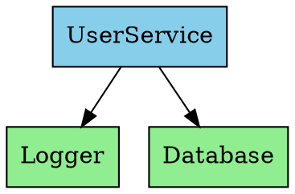
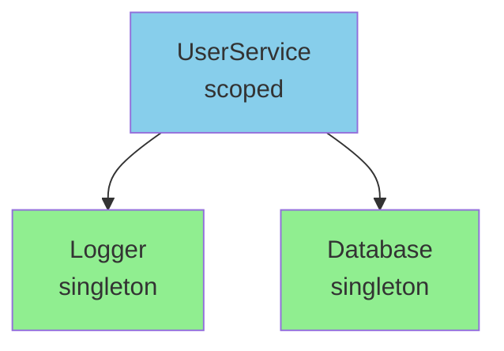

# DevTools Usage

This guide covers using `@hex-di/devtools` for visualizing dependency graphs and debugging service resolution.

## Installation

```bash
pnpm add @hex-di/devtools
```

## Overview

`@hex-di/devtools` provides:
- **Export Functions** - Convert graphs to JSON, DOT, and Mermaid formats
- **Transform Utilities** - Filter and relabel exported graphs
- **React Components** - Interactive DevTools panels
- **Tracing** - Service resolution monitoring

## Exporting Graphs

### JSON Export

Export your graph as a structured JSON object:

```typescript
import { toJSON } from '@hex-di/devtools';

const exported = toJSON(appGraph);
console.log(JSON.stringify(exported, null, 2));
```

Output structure:

```json
{
  "nodes": [
    {
      "portName": "Logger",
      "lifetime": "singleton",
      "dependencies": []
    },
    {
      "portName": "UserService",
      "lifetime": "scoped",
      "dependencies": ["Logger", "Database"]
    }
  ],
  "edges": [
    { "from": "UserService", "to": "Logger" },
    { "from": "UserService", "to": "Database" }
  ]
}
```

### DOT Export (Graphviz)

Generate Graphviz DOT format for visualization:

```typescript
import { toDOT } from '@hex-di/devtools';

const dot = toDOT(appGraph);
console.log(dot);
```

Output:



Render with Graphviz:

```bash
echo "$dot" | dot -Tpng -o graph.png
```

### DOT Options

```typescript
const dot = toDOT(appGraph, {
  title: 'My App Dependencies',
  rankdir: 'LR',  // Left to right
  colors: {
    singleton: '#90EE90',  // Light green
    scoped: '#87CEEB',     // Light blue
    request: '#FFB6C1'     // Light pink
  }
});
```

### Mermaid Export

Generate Mermaid diagrams for documentation:

```typescript
import { toMermaid } from '@hex-di/devtools';

const mermaid = toMermaid(appGraph);
console.log(mermaid);
```

Output:



### Mermaid Options

```typescript
const mermaid = toMermaid(appGraph, {
  direction: 'LR',  // Left to right
  showLifetime: true,
  theme: 'forest'
});
```

## Filtering and Transforming

### filterGraph

Filter nodes by predicate:

```typescript
import { toJSON, filterGraph, byLifetime, byPortName } from '@hex-di/devtools';

const exported = toJSON(appGraph);

// Filter by lifetime
const singletons = filterGraph(exported, byLifetime('singleton'));
const scoped = filterGraph(exported, byLifetime('scoped'));

// Filter by port name pattern
const userServices = filterGraph(exported, byPortName(/User/));
const stores = filterGraph(exported, byPortName(/Store$/));
```

### Chaining Filters

```typescript
import { filterGraph, byLifetime, byPortName } from '@hex-di/devtools';

const exported = toJSON(appGraph);

// Combine filters
const scopedUserServices = filterGraph(
  filterGraph(exported, byLifetime('scoped')),
  byPortName(/User/)
);
```

### Custom Filter Predicates

```typescript
const exported = toJSON(appGraph);

// Custom predicate
const withDependencies = filterGraph(exported, (node) =>
  node.dependencies.length > 0
);

// Filter by specific dependency
const dependsOnLogger = filterGraph(exported, (node) =>
  node.dependencies.includes('Logger')
);
```

### relabelPorts

Transform node labels:

```typescript
import { toJSON, relabelPorts } from '@hex-di/devtools';

const exported = toJSON(appGraph);

// Add prefix
const relabeled = relabelPorts(exported, (name) => `App.${name}`);

// Simplify names
const simplified = relabelPorts(exported, (name) =>
  name.replace('Service', '').replace('Port', '')
);
```

## React DevTools Components

### DevToolsFloating

A floating panel for development:

```typescript
import { DevToolsFloating } from '@hex-di/devtools';
import { appGraph } from './di/graph';
import { container } from './di/container';

function App() {
  return (
    <ContainerProvider container={container}>
      <MyApp />

      {/* Only show in development */}
      {process.env.NODE_ENV === 'development' && (
        <DevToolsFloating
          graph={appGraph}
          container={container}
          position="bottom-right"
        />
      )}
    </ContainerProvider>
  );
}
```

### DevToolsFloating Props

| Prop | Type | Default | Description |
|------|------|---------|-------------|
| `graph` | `Graph` | required | The dependency graph |
| `container` | `Container` | optional | Container for runtime info |
| `position` | `'bottom-right' \| 'bottom-left' \| 'top-right' \| 'top-left'` | `'bottom-right'` | Panel position |
| `defaultOpen` | `boolean` | `false` | Start expanded |

### DevToolsPanel

An embeddable panel for custom layouts:

```typescript
import { DevToolsPanel } from '@hex-di/devtools';

function DebugPage() {
  return (
    <div className="debug-container">
      <h1>Dependency Graph</h1>
      <DevToolsPanel
        graph={appGraph}
        container={container}
        height={600}
      />
    </div>
  );
}
```

### DevToolsPanel Props

| Prop | Type | Default | Description |
|------|------|---------|-------------|
| `graph` | `Graph` | required | The dependency graph |
| `container` | `Container` | optional | Container for runtime info |
| `width` | `number \| string` | `'100%'` | Panel width |
| `height` | `number \| string` | `400` | Panel height |

## DevTools Features

### Graph Tab

Visual representation of your dependency graph:
- Nodes colored by lifetime (singleton=green, scoped=blue, request=pink)
- Edges show dependency relationships
- Interactive zoom and pan
- Click nodes to see details

### Services Tab

Runtime information about resolved services:
- Singleton instances and their creation time
- Active scopes and their services
- Resolution call counts
- Service dependency tree

### Tracing Tab

Service resolution timeline (requires tracing container):
- Resolution order
- Time taken per service
- Dependency chain visualization
- Error tracing

## Tracing

### Creating a Tracing Container

```typescript
import { createTracingContainer } from '@hex-di/devtools';
import { appGraph } from './di/graph';

// Wrap your graph in a tracing container
const container = createTracingContainer(appGraph);

// Use as normal - tracing happens automatically
const logger = container.resolve(LoggerPort);
```

### Tracing Options

```typescript
const container = createTracingContainer(appGraph, {
  // Maximum traces to keep
  maxTraces: 1000,

  // Retention policy
  retention: 'sliding-window', // or 'first-n', 'last-n'

  // Filter which resolutions to trace
  filter: (portName) => !portName.includes('Logger')
});
```

### Accessing Trace Data

```typescript
import { TRACING_ACCESS } from '@hex-di/runtime';

// Get trace data from container
const tracingApi = container[TRACING_ACCESS];

// Get all traces
const traces = tracingApi.getTraces();

// Get statistics
const stats = tracingApi.getStats();
console.log(stats);
// {
//   totalResolutions: 150,
//   byPort: {
//     Logger: { count: 50, totalTime: 5 },
//     UserService: { count: 25, totalTime: 120 }
//   }
// }

// Clear traces
tracingApi.clearTraces();
```

### Trace Structure

```typescript
interface Trace {
  id: string;
  portName: string;
  timestamp: number;
  duration: number;
  lifetime: 'singleton' | 'scoped' | 'request';
  cached: boolean;  // Was it a cache hit?
  scopeId?: string; // If resolved from scope
  dependencies: string[];  // Ports resolved as dependencies
  error?: Error;    // If resolution failed
}
```

## Using Exports in Documentation

### Embedding Mermaid in Markdown

```typescript
// scripts/generate-docs.ts
import { toMermaid } from '@hex-di/devtools';
import { appGraph } from '../src/di/graph';
import { writeFileSync } from 'fs';

const mermaid = toMermaid(appGraph);

const markdown = `
# Dependency Graph

\`\`\`mermaid
${mermaid}
\`\`\`
`;

writeFileSync('docs/dependency-graph.md', markdown);
```

### Generating PNG with Graphviz

```typescript
// scripts/generate-graph-image.ts
import { toDOT } from '@hex-di/devtools';
import { appGraph } from '../src/di/graph';
import { execSync } from 'child_process';
import { writeFileSync } from 'fs';

const dot = toDOT(appGraph, { title: 'App Dependencies' });
writeFileSync('graph.dot', dot);

// Requires Graphviz installed
execSync('dot -Tpng graph.dot -o docs/images/dependency-graph.png');
```

### CI Integration

Add to your CI pipeline:

```yaml
# .github/workflows/docs.yml
- name: Generate dependency graph
  run: |
    pnpm run generate:graph
    git add docs/images/dependency-graph.png
    git diff --staged --quiet || git commit -m "chore: update dependency graph"
```

## Debugging Tips

### Finding Circular Dependencies

Export and analyze your graph:

```typescript
import { toJSON } from '@hex-di/devtools';

const exported = toJSON(appGraph);

// Find potential cycles
function findCycles(nodes) {
  const visited = new Set();
  const path = [];

  function dfs(node) {
    if (path.includes(node.portName)) {
      console.log('Potential cycle:', [...path, node.portName]);
      return;
    }
    if (visited.has(node.portName)) return;

    visited.add(node.portName);
    path.push(node.portName);

    for (const dep of node.dependencies) {
      const depNode = nodes.find(n => n.portName === dep);
      if (depNode) dfs(depNode);
    }

    path.pop();
  }

  nodes.forEach(node => dfs(node));
}

findCycles(exported.nodes);
```

### Analyzing Dependency Depth

```typescript
function maxDepth(nodes) {
  const depths = {};

  function getDepth(portName) {
    if (depths[portName] !== undefined) return depths[portName];

    const node = nodes.find(n => n.portName === portName);
    if (!node || node.dependencies.length === 0) {
      depths[portName] = 0;
      return 0;
    }

    const maxChildDepth = Math.max(
      ...node.dependencies.map(dep => getDepth(dep))
    );
    depths[portName] = maxChildDepth + 1;
    return depths[portName];
  }

  nodes.forEach(node => getDepth(node.portName));
  return depths;
}

const exported = toJSON(appGraph);
const depths = maxDepth(exported.nodes);
console.log('Dependency depths:', depths);
```

### Finding Most Depended-On Services

```typescript
function mostDependedOn(nodes) {
  const counts = {};

  for (const node of nodes) {
    for (const dep of node.dependencies) {
      counts[dep] = (counts[dep] || 0) + 1;
    }
  }

  return Object.entries(counts)
    .sort(([, a], [, b]) => b - a)
    .map(([name, count]) => ({ name, count }));
}

const exported = toJSON(appGraph);
console.log('Most depended on:', mostDependedOn(exported.nodes));
```

## Complete Example

```typescript
// src/debug/devtools-setup.ts
import { DevToolsFloating, createTracingContainer, toMermaid } from '@hex-di/devtools';
import { appGraph } from '../di/graph';

// Create tracing container for development
export const container = process.env.NODE_ENV === 'development'
  ? createTracingContainer(appGraph)
  : createContainer(appGraph);

// Generate documentation on demand
export function generateGraphDocs() {
  const mermaid = toMermaid(appGraph, {
    direction: 'TB',
    showLifetime: true
  });

  console.log('```mermaid');
  console.log(mermaid);
  console.log('```');
}

// App.tsx
import { DevToolsFloating } from '@hex-di/devtools';
import { container } from './debug/devtools-setup';

export function App() {
  return (
    <ContainerProvider container={container}>
      <MyApp />
      {process.env.NODE_ENV === 'development' && (
        <DevToolsFloating
          graph={appGraph}
          container={container}
          position="bottom-right"
          defaultOpen={false}
        />
      )}
    </ContainerProvider>
  );
}
```

## Next Steps

- Learn [Testing Strategies](./testing-strategies.md)
- Explore [Error Handling](./error-handling.md)
- See the [DevTools API Reference](../api/devtools.md)
